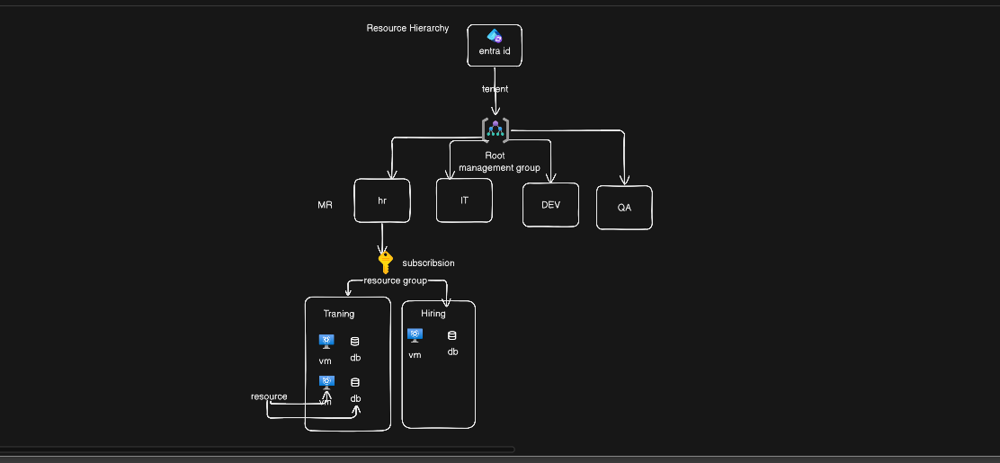

# AZ-900: Microsoft Azure Fundamentals
## Unit 2 — Azure Architecture and Compute Services

**Course Outcomes Covered:** CO2 — Describe Azure architectural components and resource hierarchy. CO3 — Identify Azure compute, storage, networking and identity services (compute portion).

**Note on scope:** The syllabus lists Azure Regions and Availability Zones, Datacenters, Resources and Resource Groups, Subscriptions and Management Groups, Resource Hierarchy, Azure Compute Services, Virtual Machines, App Services, and Containers Overview. The actual AZ-900 exam objective this unit maps to is **"Describe Azure architecture and services,"** which additionally and explicitly tests: **Availability Sets, VM Scale Sets, Azure Container Apps, Azure Functions, Azure Virtual Desmodels, Azure Resource Manager, Region Pairs, Sovereign Regions, and an Application Hosting decision framework.** All of these are included below and marked **(AZ-900 Add-on)** wherever they extend beyond the syllabus wording, so the notes fully align with what Microsoft actually tests, not just the syllabus line items.

---

## 1. Azure Physical Infrastructure: Datacenters

A **datacenter** is a physical facility containing the servers, storage, networking equipment, power systems, and cooling systems that actually run cloud workloads. Azure's global infrastructure is built from a large number of these facilities, grouped and organized in a specific hierarchy designed for both performance and resilience.

**Key point:** A datacenter is the smallest physical unit in Azure's infrastructure hierarchy. Customers never interact with or select an individual datacenter directly — instead, they choose a **region**, which is made up of one or more datacenters.

---

## 2. Azure Regions

A **region** is a geographic area containing one or more datacenters, networked together with a low-latency, dedicated regional network. Examples: East US, West Europe, Central India, Southeast Asia.

**Why regions matter:**
- **Latency:** Deploying resources in a region close to end users reduces network latency (ties directly to Global Reach, Unit 1).
- **Data residency and compliance:** Some organizations are legally required to keep data within a specific country or geography; choosing the correct region satisfies this.
- **Service availability:** Not every Azure service is available in every region — new services often roll out to major regions first.
- **Pricing:** Costs can vary slightly by region due to local infrastructure and operating costs.

**Example:**
An educational platform serving students primarily in India deploys its application in the Central India region rather than East US. This reduces the round-trip time for every request, resulting in a noticeably faster experience for its actual user base, and also helps satisfy any local data-residency expectations.

### 2.1 Region Pairs

Most Azure regions are paired with another region within the same geography, at least 300 miles apart, called a **region pair** (e.g., East US paired with West US; North Europe paired with West Europe).

**Purpose of region pairs:**
- If a major disaster affects one region in the pair, Microsoft prioritizes restoring service in the paired region first.
- Some Azure services automatically replicate data to the paired region for disaster recovery (geo-redundant storage, covered further in Unit 3).
- Planned Azure platform updates are rolled out to only one region in a pair at a time, reducing the risk of both regions being affected simultaneously by an update-related issue.

**Example:**
An organization using geo-redundant storage in East US automatically has its data asynchronously replicated to West US, the paired region, without any manual configuration — a baseline layer of disaster recovery tied directly to region pairing.

### 2.2 Sovereign and Special Regions

Some Azure regions are isolated from the rest of Azure for compliance or national security reasons — for example, regions serving U.S. government agencies, or China (operated by a separate licensed partner). These are operated separately with restricted access, meeting regulatory requirements that standard public regions do not, and are not accessible through a normal public Azure subscription.

---

## 3. Availability Zones (Architectural Context)

An **Availability Zone** is a physically separate location within an Azure region, each with its own independent power source, cooling, and networking.

**Key architectural facts for AZ-900:**
- Most (but not all) Azure regions that support Availability Zones have a **minimum of three separate zones**.
- Zones within a region are connected by high-speed, low-latency private fiber connections.
- Not every Azure region supports Availability Zones — this affects region choice for HA-critical workloads.

**Example:**
A company deploys its application's VMs across three Availability Zones within the same region. If a fire affects the datacenter in Zone 1, Zones 2 and 3 are unaffected and continue serving traffic, because each zone has independent power and cooling infrastructure.

### 3.1 Availability Sets (AZ-900 Add-on)

Before Availability Zones existed as a region-wide concept, and still used today for VMs deployed **within a single datacenter**, Azure provides **Availability Sets** — a logical grouping that protects VMs from localized hardware failure inside one datacenter by spreading them across separate **fault domains** and **update domains**.

- **Fault Domain:** A group of hardware (server rack, power source, network switch) that shares a single point of failure. VMs in an Availability Set are automatically spread across multiple fault domains (typically up to 3), so a single rack or power failure does not take down all VM instances at once.
- **Update Domain:** A logical grouping that determines which VMs get rebooted together during planned host maintenance (such as OS patching on the underlying physical host). VMs are spread across multiple update domains (typically up to 20) so Azure never restarts every VM in the set at the same time during planned maintenance.

**Why this is distinct from Availability Zones (a common exam confusion point):**

| Feature | Availability Set | Availability Zone |
|---|---|---|
| Protection scope | Within a single datacenter (rack/host level) | Across physically separate datacenters within a region |
| Protects against | Hardware rack failure, planned host maintenance | Entire datacenter failure (power, fire, flooding) |
| Mechanism | Fault domains + update domains | Independent physical locations |
| Cost | No additional cost | No additional cost, but requires a zone-supporting region |

**Example:**
A company deploys two web server VMs in an Availability Set. Azure automatically places them in different fault domains, so if one server rack loses power, only one VM is affected and the other continues serving traffic. When Microsoft performs planned maintenance on the underlying physical hosts, the two VMs are also placed in different update domains, so both VMs are never rebooted at the same time — the application stays available throughout the maintenance window.

---

## 4. Resources and Resource Groups

### 4.1 Resources
A **resource** is any individual service instance created in Azure — a virtual machine, a storage account, a virtual network, a database, an App Service, and so on. Every object you create and manage in Azure is a resource.

### 4.2 Resource Groups
A **resource group** is a logical container used to group related Azure resources together for management, deployment, and billing purposes.

**Key rules and facts about resource groups:**
- Every resource must belong to exactly **one** resource group.
- Resources within a group can span multiple regions.
- Deleting a resource group deletes **all** resources within it — a common source of accidental data loss and a frequently tested exam point.
- Resource groups do not represent a pricing-tier boundary — they exist purely for organizational and lifecycle management.
- Access permissions (via Role-Based Access Control) can be applied at the resource group level, automatically applying to all resources inside it.

**Example:**
A company deploys a web application consisting of a virtual machine, a storage account, and a virtual network. All three are placed in a single resource group named "WebApp-Prod." When the project ends, the administrator deletes the "WebApp-Prod" resource group, and all three resources are automatically deleted together, rather than needing to be deleted one by one.

---

## 5. Subscriptions

An Azure **subscription** is a logical container used to provision resources and is linked to billing. It defines the boundary for cost tracking and, by default, applies quotas/limits on resource usage.

**Key facts:**
- A subscription is tied to an Azure account and a payment method.
- Resource groups exist within a subscription; a resource group cannot span multiple subscriptions.
- Organizations often use multiple subscriptions to separate environments (e.g., Development, Testing, Production) or separate departments, so each has its own billing and access boundary.
- Azure enforces certain default limits per subscription (e.g., maximum number of resource groups), which can sometimes be increased via a support request.

**Example:**
A university creates two separate subscriptions: one for its Computer Science department's research projects and one for its administrative IT systems. This ensures each department's cloud spending is billed and tracked completely separately, and a budget overrun in one subscription does not affect the other.

---

## 6. Management Groups

A **management group** is a container used to manage access, policy, and compliance across **multiple subscriptions** at once. Management groups sit above subscriptions in the resource hierarchy.

**Key facts:**
- Management groups can be nested (a management group can contain other management groups, up to a defined depth).
- Policies and access controls applied at a management group level are automatically inherited by every subscription (and every resource group and resource) underneath it.
- All subscriptions within a single Azure Active Directory (Microsoft Entra ID) tenant ultimately roll up into a single top-level **root management group**.

**Example:**
A large enterprise creates a management group called "Finance-Division" containing three subscriptions belonging to different finance sub-teams. The IT administrator applies a single security policy at the "Finance-Division" management group level (e.g., "only allow VM deployment in India regions"), and this policy automatically applies to all resources across all three subscriptions underneath it, without needing to configure the policy three separate times.

---

## 7. Resource Hierarchy

Azure organizes everything into a strict, nested hierarchy. Understanding this hierarchy — and which level policies/permissions are applied at, and how they inherit downward — is one of the most heavily tested architectural concepts on AZ-900.

**Hierarchy, from top to bottom:**

```
Root Management Group
        │
Management Groups (can be nested)
        │
    Subscriptions
        │
   Resource Groups
        │
     Resources
```

**Inheritance rule:** Settings applied at a higher level (such as a management group) automatically flow down to every level beneath it (subscriptions → resource groups → resources), unless explicitly overridden at a lower level.

**Example combining the full hierarchy:**
An organization has a root management group, under which sits a "Production" management group. Under "Production" are two subscriptions: "Sales-Prod" and "Marketing-Prod." Within "Sales-Prod," there is a resource group called "CRM-App," which contains a virtual machine and a database. A cost-control policy applied at the "Production" management group level automatically restricts expensive VM sizes across both the "Sales-Prod" and "Marketing-Prod" subscriptions, and therefore across every resource group and resource nested beneath them, including the VM inside "CRM-App."

---

## 8. Azure Resource Manager (ARM)

**Azure Resource Manager (ARM)** is the deployment and management layer that sits behind every interaction with Azure — whether through the Azure Portal, Azure CLI, Azure PowerShell, or REST API calls. ARM is what actually receives requests to create, update, or delete resources and enforces consistency across all of them.

**Why this matters here rather than in Unit 5:** ARM is fundamentally tied to how the resource hierarchy (Section 7) is enforced — every policy, access control, and tag applied at a management group, subscription, or resource group level is processed and enforced by ARM. It is covered here as essential background for the hierarchy, though pricing/deployment tools built on ARM are revisited in Unit 5.

**Key facts:**
- All requests, regardless of which tool is used (Portal, CLI, PowerShell), go through the same ARM API, ensuring consistent behavior no matter which interface an administrator uses.
- ARM enables **declarative deployment** through ARM templates (JSON files describing the desired end-state of infrastructure), allowing consistent, repeatable deployments — an early, concrete form of the Infrastructure as Code idea introduced conceptually in Unit 1 and expanded in Unit 5.
- ARM is responsible for applying Role-Based Access Control (RBAC) checks and Azure Policy enforcement at the moment a resource is created or modified.
- ARM processes requests as **resource groups**, meaning all resources in a single template deployment are created, updated, or deleted together in a coordinated way.

**Example:**
Whether an administrator creates a virtual machine by clicking through the Azure Portal or by running an Azure CLI command, both actions are translated into the same underlying ARM API call. This is why a policy blocking a specific VM size applies consistently, regardless of which method was used to attempt the deployment.

---

## 9. Azure Compute Services (Overview)

**Compute** refers to the processing power used to run applications and workloads. Azure offers multiple compute service types, each suited to different scenarios depending on how much infrastructure control is needed versus how much convenience is preferred (directly connecting to the IaaS/PaaS spectrum from Unit 1).

| Compute Service | Management Level | Best Suited For |
|---|---|---|
| Virtual Machines | Customer manages OS and above (IaaS) | Full control, legacy app migration |
| Availability Sets / VM Scale Sets | Customer manages OS, provider automates resilience/scaling | Protecting or scaling groups of VMs |
| App Services | Provider manages OS/runtime (PaaS) | Web apps, REST APIs, mobile backends |
| Containers (ACI / Container Apps / AKS) | Varies — provider manages more as you move toward AKS | Portable, consistent app packaging and orchestration |
| Azure Functions | Provider manages nearly everything (Serverless) | Small, event-triggered pieces of code |
| Azure Virtual Desktop | Provider manages virtualization infrastructure | Remote/virtual desktop access |

---

## 10. Virtual Machines

An **Azure Virtual Machine (VM)** is an IaaS offering that provides on-demand, scalable computing resources, giving the customer a virtualized server they fully control from the operating system upward.

**Key characteristics:**
- Customer selects the VM "size" (combination of CPU, RAM, and disk performance) based on workload needs.
- Customer chooses the operating system image (Windows or a Linux distribution) — images can come from the **Azure Marketplace**, which offers pre-configured images (e.g., an image with SQL Server already installed) in addition to plain OS images.
- Customer is responsible for OS patching, security configuration, and installed software, consistent with the IaaS responsibilities described in Unit 1.
- Billed based on the VM size and the amount of time it runs (consumption-based pricing).

### 10.1 Availability Sets and VM Scale Sets — the Two VM Resilience/Scaling Tools

Section 3.1 introduced Availability Sets conceptually; it is repeated here specifically in the VM-management context because AZ-900 groups "VM options" together as one exam sub-topic.

**Azure Virtual Machine Scale Sets** let an administrator deploy and manage a group of identical, load-balanced VMs, with the number of instances increasing or decreasing automatically based on demand or a defined schedule.

**Relationship to Unit 1 concepts:** VM Scale Sets are the concrete Azure feature that implements horizontal scaling (Unit 1, Section 10) and elasticity (Unit 1, Section 11) for virtual machines specifically.

**Distinguishing the three VM-related resilience/scaling tools (a frequent point of exam confusion):**

| Tool | Purpose | Scope |
|---|---|---|
| Availability Set | Protect a fixed group of VMs from rack/host-level failure | Single datacenter |
| Availability Zone | Protect VMs from entire datacenter failure | Across a region |
| VM Scale Set | Automatically grow/shrink the number of identical VM instances based on demand | Can span zones within a region |

**Example:**
A company running a web application on VMs uses a VM Scale Set configured to automatically add VM instances when average CPU usage exceeds 75%, and remove instances when usage drops below 25%. During a traffic spike, new identical VM instances are automatically created and added behind a load balancer without manual intervention — directly demonstrating the elasticity concept from Unit 1 applied specifically to virtual machines. If this scale set is also configured to spread instances across Availability Zones, the application is protected from both demand spikes and datacenter-level failure at the same time.

---

## 11. App Services

**Azure App Service** is a PaaS offering used to build, deploy, and scale web applications, REST APIs, and mobile app backends, without the customer needing to manage the underlying servers or operating system.

**Key characteristics:**
- Supports multiple languages and frameworks (.NET, Java, Node.js, Python, PHP, and others).
- Built-in support for automatic scaling, load balancing, and continuous deployment from source control.
- Provides deployment slots (e.g., staging and production), allowing an application to be tested in a staging environment before being swapped into production with minimal downtime.
- OS patching, server maintenance, and infrastructure scaling are all handled automatically by Azure.

**Example:**
A development team builds a customer support ticketing web application and deploys it to Azure App Service. They configure a staging deployment slot, test a new feature there, and once satisfied, swap the staging slot into production. Throughout this entire process, the team never has to configure a server, install an operating system, or apply security patches — Azure handles all of that automatically, consistent with the PaaS responsibility split introduced in Unit 1.

---

## 12. Containers Overview

A **container** packages an application together with all of its dependencies (libraries, runtime, configuration) into a single, portable unit that runs consistently across different environments — a developer's laptop, a testing server, or Azure — because the container includes everything the application needs to run.

**Why containers matter (conceptually):**
- Solves the "it works on my machine" problem by ensuring the exact same environment travels with the application everywhere.
- More lightweight than a full virtual machine, since containers share the host operating system's kernel rather than each running a complete separate OS.
- Enables faster startup times and more efficient use of underlying compute resources compared to VMs.

**Azure's container services:**

| Service | Description | Best Suited For |
|---|---|---|
| **Azure Container Instances (ACI)** | Runs a single container (or small group) quickly, without managing any underlying VMs or orchestration | Simple, short-lived, or burst workloads |
| **Azure Container Apps** | A serverless container platform built on Kubernetes underneath, but without exposing Kubernetes management to the customer | Microservices and event-driven apps that need autoscaling without full Kubernetes complexity |
| **Azure Kubernetes Service (AKS)** | Manages large-scale deployment, scaling, and orchestration of many containers using Kubernetes, with full control over the Kubernetes configuration | Complex, production-grade, multi-container applications needing fine-grained orchestration control |

**Example:**
A data science team needs to run a short batch job that processes a dataset for 20 minutes and then stops. They package the job as a container and run it on Azure Container Instances, which starts the container quickly without requiring the team to provision or manage any virtual machines, and the cost stops the moment the container finishes running.

A separate team building a set of microservices wants automatic scaling and simple deployment but does not want to manage Kubernetes clusters, nodes, or networking configuration directly — they use **Azure Container Apps**, which runs on Kubernetes internally but exposes only a simplified deployment experience.

In contrast, an e-commerce company running dozens of interdependent microservices (product catalog, cart, payment, shipping) that needs fine-grained control over networking, scaling rules, and cluster configuration uses **Azure Kubernetes Service** directly, accepting the added management complexity in exchange for full control — something neither ACI nor Container Apps is designed to expose.

---

## 13. Azure Functions — Serverless Compute

**Azure Functions** is Azure's serverless compute offering, used to run small, independent pieces of code ("functions") that execute automatically in response to a trigger — such as an HTTP request, a message arriving in a queue, or a scheduled timer — without the customer provisioning or managing any server at all.

**Why "serverless" and why it matters here:** Functions represent the far end of the IaaS-to-SaaS management spectrum introduced in Unit 1 — the customer writes only the code; Azure handles absolutely everything else, including automatically scaling the number of executions up or down (including down to zero when not in use, so there is no cost when the function is idle).

**Key characteristics:**
- Billed based on actual execution time and number of executions, not on any pre-allocated server capacity — an extreme example of consumption-based pricing (Unit 1, Section 8).
- Ideal for small, event-driven tasks rather than long-running applications.
- Scales automatically and near-instantly in response to incoming trigger volume.

**Example:**
An online store wants to send a confirmation email every time a new order is placed. Instead of running a dedicated server waiting for orders, they write a small Azure Function triggered automatically whenever a new order record is added to their database. The function runs only for the few seconds needed to send the email, and the store is billed only for that brief execution time, with zero cost during the times no orders are being placed.

---

## 14. Azure Virtual Desktop

**Azure Virtual Desktop** is a desktop and app virtualization service that runs on Azure, allowing users to access a full Windows desktop environment and applications remotely from virtually any device, with the actual computing happening in Azure rather than on the user's local device.

**Example:**
A company allows employees to work from personal laptops while still securely accessing the same corporate Windows desktop environment, applications, and company data as if they were using an office computer, with all processing and data storage remaining within Azure rather than on the employee's personal device — useful for security and compliance in remote-work scenarios.

---

## 15. Application Hosting Options — Decision Framework (AZ-900 Add-on)

AZ-900 frequently presents a scenario and asks which compute option is the best fit. This section consolidates Sections 10–14 into a single decision framework, which is how the exam actually tests this material.

| Requirement in the Scenario | Best-Fit Option |
|---|---|
| "Full control over OS, migrating an existing on-prem app as-is" | Virtual Machine |
| "Protect a small fixed group of VMs from hardware failure in one datacenter" | Availability Set |
| "Protect VMs from an entire datacenter going down" | Availability Zone |
| "Automatically grow/shrink the number of identical VMs with demand" | VM Scale Set |
| "Deploy a web app/API quickly, don't want to manage servers or OS" | App Service |
| "Run one container quickly for a short, simple task" | Azure Container Instances |
| "Run multiple containers with autoscaling, without managing Kubernetes directly" | Azure Container Apps |
| "Full control over container orchestration at large scale" | Azure Kubernetes Service |
| "Run a small piece of code only when triggered by an event, pay nothing when idle" | Azure Functions |
| "Give remote employees a secure virtual Windows desktop" | Azure Virtual Desktop |

**Example combining the framework:**
A retail company needs three things: a customer-facing website (choose App Service), a background process that resizes product images only when a new image is uploaded (choose Azure Functions), and a legacy inventory system it must migrate unchanged from its old on-premises server (choose a Virtual Machine, placed in an Availability Set since it is a single critical VM that cannot yet be made redundant across zones). Walking through a scenario like this is exactly the reasoning pattern the AZ-900 exam expects.

---

## Unit 2 Summary (Quick Revision)

- **Datacenters** are the physical facilities forming the base of Azure's infrastructure; customers select a **region**, not an individual datacenter.
- **Regions** are geographic groupings of datacenters; most are organized into **Region Pairs** for disaster recovery and staged platform updates. Some regions are **sovereign/isolated** for compliance reasons.
- **Availability Zones** protect against datacenter-level failure across a region; **Availability Sets** protect against rack/host-level failure within a single datacenter using **fault domains** and **update domains** — these are two distinct tools, not the same thing.
- **Resources** are individual service instances; **Resource Groups** logically contain related resources for unified management and lifecycle — deleting a group deletes everything inside it.
- **Subscriptions** define billing and quota boundaries; **Management Groups** allow policy and access control across multiple subscriptions at once, and can be nested.
- **Resource Hierarchy** flows: Root Management Group → Management Groups → Subscriptions → Resource Groups → Resources, with settings inherited top-down.
- **Azure Resource Manager (ARM)** is the underlying deployment/management engine behind every Azure interaction (Portal, CLI, PowerShell), enforcing policy and access consistently, and enabling template-based (Infrastructure as Code) deployment.
- **Compute Services** span a spectrum from full control to full automation: Virtual Machines (IaaS) → Availability Sets/VM Scale Sets (resilience and scaling for VMs) → App Services (PaaS) → Containers (ACI for simple, Container Apps for serverless orchestration, AKS for full Kubernetes control) → Azure Functions (serverless) → Azure Virtual Desktop (virtualized desktops).
- The **Application Hosting decision framework** ties every compute option to the scenario keywords AZ-900 uses to test it.

---

## Practice Questions (Self-Check)

1. What happens to all resources inside a resource group when the resource group itself is deleted?
2. Explain the difference between a subscription and a management group, and how they relate in the resource hierarchy.
3. What is a region pair, and what two purposes does it serve?
4. Explain the difference between an Availability Set and an Availability Zone. Which one uses fault domains and update domains?
5. A company needs to run several microservices with automatic scaling but does not want to manage Kubernetes directly. Should they use Azure Container Instances, Azure Container Apps, or Azure Kubernetes Service? Why?
6. Why is Azure Functions described as "serverless," and how does its billing model differ from a Virtual Machine's billing model?
7. Explain, using the resource hierarchy, how a single policy applied at a management group level can affect resources several levels below it without being configured individually at each level.
8. What is the role of Azure Resource Manager (ARM) when a resource is created through the Azure Portal versus the Azure CLI?
9. A scenario states: "We need a single virtual machine running a legacy application, and we want to protect it from a single rack losing power without moving it across datacenters." Which resilience tool fits, and why not the alternative?
10. Using the Application Hosting decision framework, choose the correct compute option for: (a) a REST API for a mobile app, (b) code that runs only when a file is uploaded to storage, (c) a fully custom Kubernetes-based deployment pipeline.

*(Answers to be discussed in class / covered in practical session mapped to Experiment 1 and Experiment 3.)*